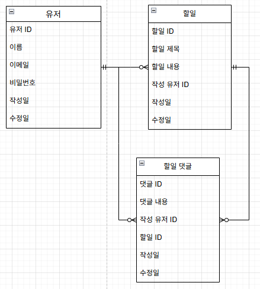
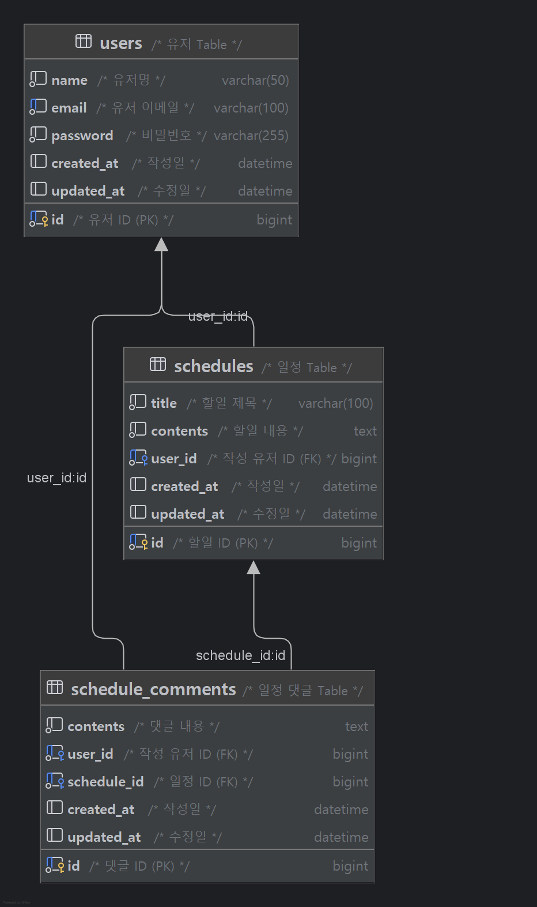

# CH 3 일정 관리 앱 Develop

## 🛠 사용 기술
- Java 17
- Spring Boot 3.4.5
- Spring Data JPA (Hibernate 6.6.13.Final)
- MySQL 9.3.0
<br>

## 💻 개발 도구
- Postman
- Git
- IntelliJ IDEA
<br>

## 📝 단계별 요구사항
`필수 기능`
- Lv 0. API 명세 및 ERD 작성
- Lv 1. 일정 CRUD
- Lv 2. 유저 CRUD
- Lv 3. 회원가입
- Lv 4. 로그인(인증)

`도전 기능`
- Lv 5. 다양한 예외처리 적용하기
- Lv 6. 비밀번호 암호화
- Lv 7. 댓글 CRUD
- Lv 8. 일정 페이징 조회
<br>

## 📜 API 명세서
Postman: [document](https://documenter.getpostman.com/view/44635744/2sB2qaigm8)
<br>

🧮 데이터 베이스 설계
<details>
<summary>최종 DB</summary>

- 개념적 설계:
  - 
- 논리적 설계(ERD):
  - 
- 물리적 설계(SQL):
  - [schdule.sql](./schdule.sql)
  - 
</details>
<br>

## 폴더 구조
```bash
src.github.gajicoding.schedule_api_project
├── api.v1
│  ├── controller       # REST API
│  ├── data             # 요청/응답 DTO, Entity
│  ├── exception        # 예외 클래스 및 처리
│  ├── filter           # 인증 필터
│  ├── repository       # DB 액세스
│  ├── service          # 비즈니스 로직
│  └── validation       # Valid 그룹
├── common        # 상수, 유틸
├── config        # 설정 관련
└── ScheduleApiProjectApplication.java
```
<br>

## 🔍 새로운 지식
프로젝트를 진행하면서 알게된 지식 정리